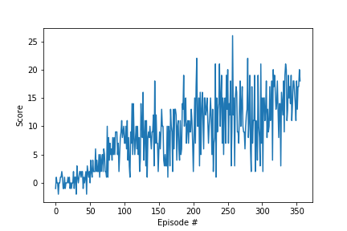

# Report: Project 1 - Navigation

The report contains the algorithm used to train the agent along with the resulting plot containing
the scores obtained by the agent over the episodes.

### Learning Algorithm
#### Deep Q-Network (DQN)

**DQN** comes under the class of algorithms known as value-based Reinforcement Learning algorithms,
where it uses a deep neural network to approximate the Q-function
to determine the optimal actions.

In the traditional **Q-learning** algorithm, first the Q-value *Q(s,a)* is randomly initialized and actions are taken 
for the current policy for that particular state. The reward and the next state thus obtained are used 
to update the policy. In **DQN** the Q-value is learned with the help of a neural network
hence it is denoted with the weights of the neural network *Q(s, a, θ)*.

**Epsilon Greedy Algorithm**
When it comes to using the Q-function learnt above is selecting which action to take.
Since the agent is still learning we can't simply select the best action based on the
learnt Q-function as this is the representation of what the agent has learnt so far.
But, if the agent can try something new, then there is a high chance the agent can get more rewards. 
It is also called as the exploration vs exploitation dilemma.

This can be achieved by the 𝛆-greedy algorithm which helps the agent to pick a random action with a probability epsilon 𝛜 to help the exploration whereas it
helps the exploitation by allowing the agent to select actions with a probability (1-𝛜) from the policy it has learnt.

Inorder to prioritize the exploitation after the time being the epsilon value is decayed.
This helps to make the agent explore more initially and to exploit the knowledge it has learned
while it gains more experience over the course of the training.


**Experience replay**<br/>
Experience replay is achieved by storing the previous experience the RL agent had
as a state, action, reward, and next state (s, a, r, s') tuple. 
These samples are randomly drawn as a training data for the neural network
in order to break the correlation between them. This helps to use the valauable experiences the agent had rater than throwing them away immediately.


**Hyper-parameters**

- BUFFER_SIZE = int(1e5)  # replay buffer size
- BATCH_SIZE = 64         # minibatch size
- GAMMA = 0.99            # discount factor
- TAU = 1e-3              # for soft update of target parameters
- LR = 5e-4               # learning rate
- UPDATE_EVERY = 4        # how often to update the network
- eps_start=1.0           # starting value for the 𝛆 in 𝛆-greedy policy
- eps_end=0.01            # ending value for the 𝛆 in 𝛆-greedy policy
- eps_decay=0.98          # decay of the 𝛆 in 𝛆-greedy policy


**Neural Network Architecture**  
The state space size is 37, therefore the input layer size is also 37.
The hidden layers sizes are 64 and 32 and since the action space size is 4 the output size of the NN is also 4.  


```
QNetwork(
  (layers): ModuleList(
    (0): Linear(in_features=37, out_features=64, bias=True)
    (1): Linear(in_features=64, out_features=32, bias=True)
  )
  (output): Linear(in_features=32, out_features=4, bias=True)
)
```


**Plot of Rewards**

The following plots shows the rewards per episode  
  
The agent is able to solve the environment in 219 episodes!

```
Episode 100	Average Score: 2.08
Episode 200	Average Score: 8.01
Episode 300	Average Score: 12.04
Episode 319	Average Score: 13.03
Environment solved in 219 episodes!	Average Score: 13.03
```


### Ideas for Future Work
Rather than using the vanilla DQN as a future work, algorithms like
- Double DQN
- Prioritized experience replay
- Dueling DQN

can be applied to solve the environment efficiently.
